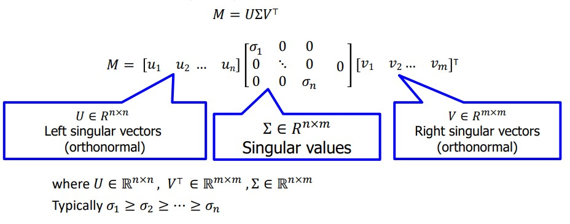

<h3>Singular Value Decomposition (SVD) </h3>
<ul>
  <li>Singular value decomposition, known as SVD, is a factorization of a real matrix </li>
  <li>For a Matrix M :</li>   
<h3>SVD Example in python</h3>
  
In this example SVD is used for image compression and then restoration:   <a href="SVD_Examle_Python.ipynb">SVD Example</a>

