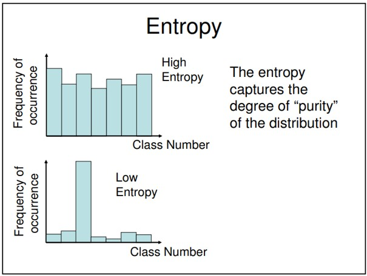
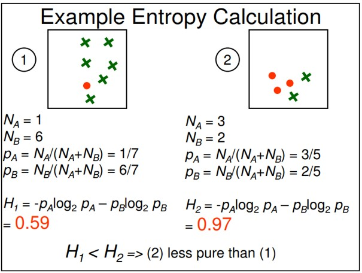
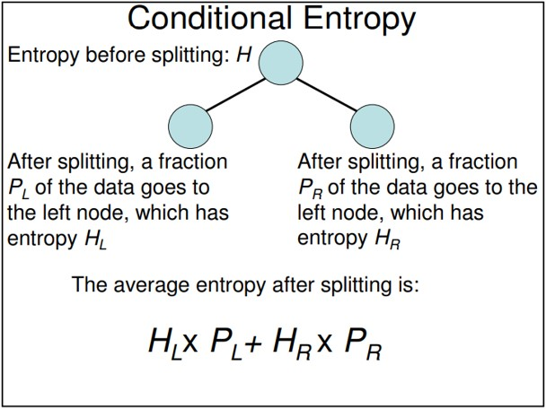
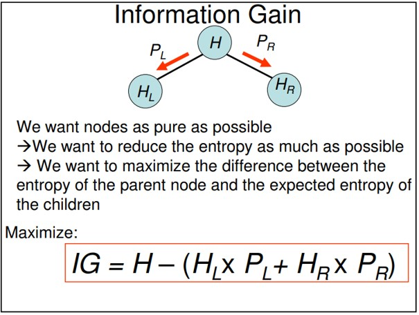
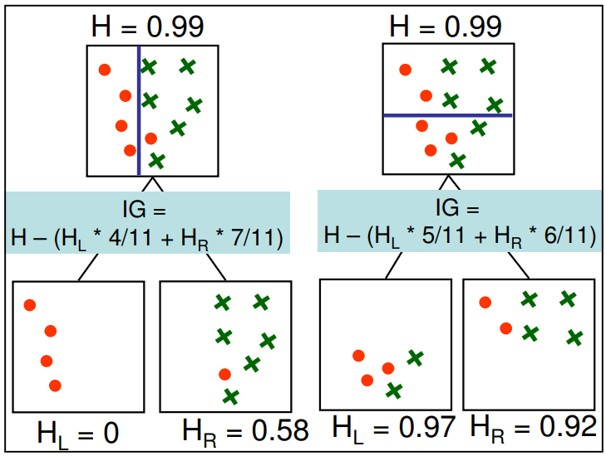

<h2> Decision Tree and Random Forest</h2>

 A decision tree is a supervised learning algorithm used for both classification and regression problems. Simply put, it takes the form of a tree with branches representing the potential answers to a given question. There are metrics used to train decision trees. One of them is information gain and is further explained here.

<h3>Design elements for decision tree</h3>
<ul>
<li>Which attributes to use when building a tree?</li>
<li>How to determine the split point for an attribute?</li>
<li>How many trees should the forest contain?</li>
<li>When do you stop splitting leaf nodes?</li>
</ul>

<h3>Entropy:</h3>
Entropy is an information theory metric that measures the impurity or uncertainty in a group of observations. It determines how a decision tree chooses to split data. The image below gives a better description of the purity of a set:

<h3>Example of Entropy Calculation:</h3>

<h3>Conditional Entropy:</h3>

<h3>Information Gain</h3>
<ul>
<li>
We can define information gain as a measure of how much information a feature provides about a class. Information gain helps to determine the order of attributes in the nodes of a decision tree.
</li>
<li>
We can use information gain to determine how good the splitting of nodes in a decision tree and it can help us determine the quality of splitting.</li>
<li>
Entropy is an information theory metric that measures the impurity or uncertainty in a group of observations. It determines how a decision tree chooses to split data. The image below gives a better description of the purity of a set.
</li>

<h3>Example of Information Gain Calculation:</h3>

  <a href='RandomForest_DecisionTrees_with_Entropy_and_InformationGain.ipynb'>Decsion Tree and Random Forest using Entropy and Information Gain (with Python)  <a> 
</li></ul>

The following were addressed through the above attempt:
<ul>
<li>Which attributes to use when building a tree?</li>
<li>How to determine the split point for an attribute?</li>
<li>How many trees should the forest contain?</li>
<li>When do you stop splitting leaf nodes?</li>
</ul>

The depth found in the learn function is the depth of the current node/tree. The max_depth parameter should be used as a stopping condition for whenyour tree should stop growing. The decision tree is instantiated with a depth of 0 (input to the learn() function in the jupyter notebook) and the root node starts at a depth of 0 and is built with increasing depth.

<h3> Reference: </h3>
<ol>
<li> <a href="https://lucylabs.gatech.edu/ml4t/summer2020/project-3/">CS 7646: Machine Learning for Trading </a> </li>
<li> Udemy Course, Mastering data visualization in D3.js </li>
</ol>
